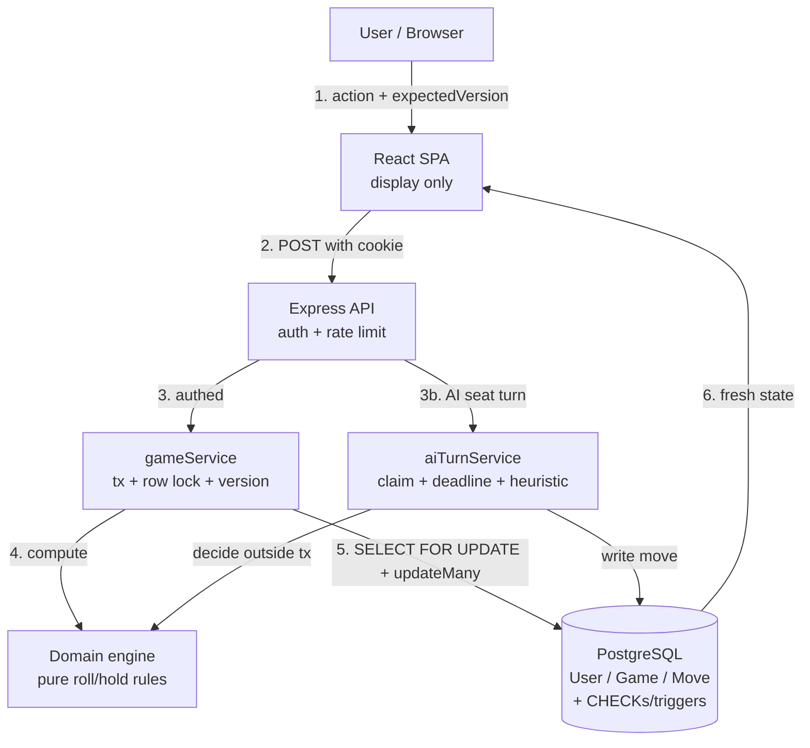
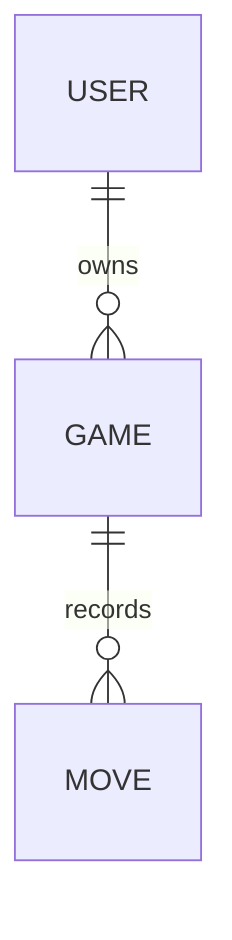

<style>
/* כפיית RTL על טקסט וטבלאות, תוך שמירה על LTR בקוד ובתרשימים */
body, p, li, ul, ol, h1, h2, h3, h4, h5, h6,
blockquote {
  direction: rtl;
  text-align: right;
}
/* טבלאות RTL — סדר העמודות מתחיל מימין, וכל תא מיושר לימין.
   !important כדי לגבור על סגנון ברירת המחדל של VS Code preview */
table, thead, tbody, tr {
  direction: rtl !important;
}
table {
  margin-right: 0 !important;
  margin-left: auto !important;
  float: none !important;
}
th, td {
  direction: rtl !important;
  text-align: right !important;
  unicode-bidi: plaintext !important;
}
/* התא הראשון בכל שורה = הימני ביותר */
tr > :first-child { border-right: none; }
/* קוד ובלוקי קוד נשארים משמאל-לימין */
pre, code, kbd, samp, pre code {
  direction: ltr;
  text-align: left;
  unicode-bidi: isolate;
}
/* מיכלי תרשימי mermaid — איפוס מלא ל-LTR עם גלילה במקום חיתוך */
.mermaid, pre.mermaid, .mermaid svg, div.mermaid {
  direction: ltr;
  text-align: left;
  unicode-bidi: isolate;
  overflow-x: auto;
  max-width: 100%;
}
/* טקסט בתוך כל צורה בתרשים — LTR וממורכז.
   unicode-bidi: plaintext גורם לכל שורה לקבוע כיוון לפי התו הראשון שלה,
   כך ששורות שמתחילות באנגלית מוצגות LTR למרות ה-RTL של המסמך. */
.dgm, .dgm * {
  direction: ltr !important;
  unicode-bidi: plaintext !important;
}
.dgm .nodeLabel, .dgm .edgeLabel, .dgm .label,
.dgm foreignObject, .dgm foreignObject div, .dgm foreignObject p,
.dgm foreignObject span, .dgm .messageText, .dgm p, .dgm span {
  text-align: center !important;
}
.dgm text, .dgm tspan {
  text-anchor: middle !important;
}
</style>

<div dir="rtl">

# Roeto Dices Game

---

## 1. הסבר כללי — מה זה בכלל?

### הבעיה במילים פשוטות

- משחק קוביות לשני שחקנים. כל תור מגלגלים שתי קוביות כמה פעמים שרוצים.
- כל גלגול מוסיף לניקוד הסיבוב.
- אם יוצא 6 ו-6 — מאבדים את כל ניקוד הסיבוב ומעבירים תור.
- אם עוצרים (hold) — ניקוד הסיבוב נכנס לניקוד הכללי, והתור עובר ליריב.
- הראשון שמגיע לניקוד המנצח (ברירת מחדל 100, ניתן לשינוי) — ניצח.

- הבעיה האמיתית שהתרגיל בודק היא לא "מי מנצח בקוביות", אלא **מי אחראי על החוקים**.
- שחקן ערמומי יכול לזייף בקשה מהדפדפן: "תוסיף לי 100 נקודות", "בטל לי את ה-6-6".
- לכן **כל חוקי המשחק חיים בשרת (backend)**, וה-frontend (צד לקוח) רק מצייר מה שהשרת מחזיר.
- השרת מחזיק זהות, מצב משחק, ואימות של כל פעולה — הדפדפן לא סומך על עצמו לכלום.

### הכלל הכי חשוב במערכת הזאת

- הכלל האחד שמסביר כמעט כל החלטה: **הדפדפן לא מחשב כלום — הוא רק שולח כוונה ומצייר תוצאה**.
- מכאן נגזר הכול: השרת מגלגל את הקוביות, השרת סופר ניקוד, השרת קובע מי ניצח.
- אפילו ה-seat (מושב, כלומר שחקן 1 או 2) שמבצע פעולה — נלקח מהשורה הנעולה בבסיס הנתונים, אף פעם לא מגוף הבקשה.

### מונחים שכדאי להכיר לפני שממשיכים

- **מושב** (seat) — מיקום שחקן במשחק: `1` או `2`. שני השחקנים משוחקים על אותו מסך.
- **עוגייה** (cookie) — פיסת מידע שהדפדפן שומר ושולח אוטומטית בכל בקשה. כאן היא נושאת את כרטיס הכניסה.
- **טוקן** (JWT) — כרטיס כניסה חתום. השרת חתם עליו, אז אי אפשר לזייף אותו בלי הסוד.
- **נעילת שורה** (row lock) — נעילה על שורת המשחק כך ששתי פעולות במקביל לא ידרסו זו את זו.
- **גרסת שורה** (version / optimistic lock) — מספר שגדל בכל שינוי, כדי לזהות שהמצב "זז" מאז שהלקוח ראה אותו.
- **מנוע דומיין** (domain engine) — קוד טהור של חוקי המשחק, בלי בסיס נתונים ובלי רשת בכלל.
- **מיגרציה** (migration) — קובץ שמתאר שינוי מבנה בבסיס הנתונים, מורץ לפי סדר.
- **היוריסטיקה** (heuristic) — כלל אצבע פשוט להחלטת ה-AI, במקום מודל שפה אמיתי.

---

## 2. ה־Flow מקצה לקצה

### שלב 1 — הרשמה והתחברות

**מה קורה כאן:**

- **צעד 1 — הלקוח שולח הרשמה או כניסה.**
  - `POST /auth/register` או `POST /auth/login`, עם `username` ו-`password` בגוף.
- **צעד 2 — השרת מריץ שרשרת בדיקות, לפי הסדר:**
  - בדיקת rate limit (הגבלת קצב) — הרשמה עד 10 לשעה, כניסה עד 5 לדקה.
  - בדיקת תוכן (Zod) — שם 3–30 תווים, סיסמה 8 תווים לפחות ועד 72 בייטים.
- **צעד 3 — טיפול בזהות:**
  - בהרשמה: מנרמלים את השם (trim + NFKC + lowercase), מגבבים סיסמה עם bcrypt, ושומרים משתמש חדש.
  - התנגשות שם משתמש נתפסת דרך ה-index הייחודי, לא בבדיקה מקדימה — כדי לסגור מרוץ.
  - בכניסה: תמיד מריצים בדיוק השוואת bcrypt אחת (גם אם השם לא קיים) מול hash דמה, כדי שזמן התגובה לא יסגיר אם שם קיים.
- **צעד 4 — השרת מנפיק cookie אחד:**
  - `token` — ה-JWT, מסומן `HttpOnly` (לא נגיש ל-JavaScript), חי 12 שעות.

**למה ככה, וההסבר למספרים:**

- הטוקן חי **12 שעות** — מספיק לישיבת משחק ארוכה, וקצר מספיק שטוקן גנוב לא ישרוד לנצח.
- **bcrypt cost 12** — איטי מספיק כדי לייקר תקיפת brute-force, מהיר מספיק לכניסה יחידה. פחות = חלש, יותר = משתמש מחכה.
- **הרשמה 10 לשעה** — יצירת חשבון היא נדירה; 10 חוסם מפעל ספאם בלי להפריע לאדם אמיתי.
- **כניסה 5 לדקה, לפי ip+username** — עוצר ניחוש סיסמאות; המפתח כולל ip כדי שתוקף לא ינעל קורבן החוצה בכוונה.

**שאלות שחוזרות בשלב הזה:**

- **ש:** למה JWT ב-cookie ולא ב-`localStorage`? — **ת:** `localStorage` נגיש לכל JavaScript, אז מתקפת XSS גונבת את הטוקן. `HttpOnly` cookie לא נגיש ל-JavaScript בכלל.
  - **הערה:** זהו פרויקט דמו — הגנת CSRF (שהייתה מתבקשת עם auth מבוסס-cookie בפרודקשן) הוסרה בכוונה כדי לפשט. במערכת אמיתית היה נדרש טוקן CSRF או בדיקת `Origin`/`SameSite` מחמירה על כל פעולה משנת-מצב.
- **ש:** מה קורה אם מוחקים משתמש או "מנתקים אותו מרחוק"? — **ת:** לכל משתמש יש `tokenVersion`. כל בקשה קוראת את הגרסה העדכנית מה-DB ומשווה לזו שבטוקן; אי-התאמה = דחייה.

**הרכיב הפעיל: PostgreSQL (טבלת `User`)**

- אילו tables: `User` — קריאה לפי `usernameKey` (index ייחודי) בכניסה, `INSERT` בהרשמה.
- למה כאן: הזהות חייבת להיות עמידה ואחת-ויחידה; index ייחודי הוא מקור האמת לשמות תפוסים.
- אם נשבר: קריאת ה-`tokenVersion` תיכשל; ה-middleware מחזיר `503` מבוקר (לא `401` מטעה) והלקוח מנסה שוב.
- כשגדלים: כניסה היא זולה; אם bcrypt מכביד — מעבירים אותו ל-worker נפרד או מעלים cost בהדרגה.
- ה-tradeoff שלא בחרנו: session ב-Redis. נמנע כדי לא לגרור תלות תשתית נוספת למשחק קטן.

**הרכיב הבא:** אחרי כניסה מוצלחת, הלקוח פונה ל-`gameService` דרך `/games` כדי ליצור או לחדש משחק.

### שלב 2 — יצירת משחק או חידוש משחק קיים

**מה קורה כאן:**

- **צעד 1 — עם עליית מסך המשחק, הלקוח שואל אם יש משחק פתוח.**
  - `GET /games?status=in_progress&limit=1`.
  - אם חוזר משחק — טוענים אותו וממשיכים ממנו (חידוש). אם ריק — פותחים חלון "משחק חדש".
- **צעד 2 — המשתמש בוחר הגדרות ושולח יצירה.**
  - `POST /games` עם `targetScore`, `mode` (`human` או `ai`), ואם AI — גם `aiSeat`.
  - Zod מוודא: `aiSeat` חובה כש-`mode=ai`, ואסור כש-`mode=human`.
- **צעד 3 — השרת יוצר משחק בתוך transaction (טרנזקציה) אחת:**
  - קודם: כל משחק `in_progress` קיים של המשתמש מסומן `abandoned` (נטוש) + `version` גדל ב-1.
  - אחר כך: נוצרת שורת משחק חדשה עם `status=in_progress`, `currentSeat=1`, ניקוד 0.
- **צעד 4 — רשת ביטחון ברמת ה-DB:**
  - index חלקי ייחודי `game_one_live_per_owner` מבטיח משחק חי אחד בלבד לכל בעלים.
  - אם שתי יצירות רצות במקביל, אחת נכשלת עם `P2002` והשרת ממפה אותה ל-`GAME_CONFLICT`.

**למה ככה, וההסבר למספרים:**

- **נטישה אוטומטית של המשחק הקודם** — הדרישה היא "אפשר לפתוח משחק חדש בכל רגע"; הנטישה מפנה את המקום מבלי למחוק היסטוריה.
- **`targetScore` בין 10 ל-1000** — מתחת ל-10 המשחק טריוויאלי, מעל 1000 הוא אינסופי; הטווח נאכף גם ב-Zod וגם ב-CHECK.
- **`limit=1` בחידוש** — הלקוח צריך רק את המשחק החי האחד; אין טעם למשוך יותר.

**שאלות שחוזרות בשלב הזה:**

- **ש:** למה לסמן נטוש ולא למחוק את המשחק הישן? — **ת:** מחיקה מוחקת גם את ה-`Move` (מהלכים); סימון שומר היסטוריה ומאפשר לספור ניצחונות בעתיד.
  - **שאלת המשך:** ולמה index חלקי ולא בדיקה בקוד? — **ת:** בדיקה בקוד פגיעה למרוץ בין שתי בקשות; ה-DB הוא הבורר האטומי היחיד.
- **ש:** מה מונע ממשתמש לשחק במשחק של מישהו אחר? — **ת:** כל קריאה עוברת `assertReadGuard` — אם `ownerUserId` לא תואם ל-`userId` מהטוקן, מקבלים `FORBIDDEN`.

**הרכיב הפעיל: PostgreSQL (טבלת `Game`)**

- אילו tables: `Game` — `updateMany` לנטישה, `create` למשחק חדש, שניהם ב-transaction אחת.
- למה כאן: אטומיות. או ששני הצעדים קורים יחד, או שאף אחד לא קורה.
- אם נשבר: היצירה נכשלת כולה; הלקוח מציג שגיאה ומאפשר לנסות שוב — אין מצב חצי-יצירה.
- כשגדלים: יצירה נדירה יחסית; ה-index על `(ownerUserId, status)` שומר על הקריאות זולות.
- ה-tradeoff שלא בחרנו: לאפשר כמה משחקים חיים במקביל. נמנע — מסבך את ה-UI ואת חוקי "המשחק הנוכחי".

**הרכיב הבא:** ברגע שיש משחק חי, כל פעולת משחק (roll/hold) עוברת ל-`gameService` עם נעילת שורה.

### שלב 3 — תור אנושי: roll ו-hold

**מה קורה כאן:**

- **צעד 1 — הלקוח שולח פעולה עם הגרסה שהוא מכיר.**
  - `POST /games/:id/roll` או `POST /games/:id/hold`, עם `expectedVersion` בגוף.
- **צעד 2 — השרת פותח transaction ונועל את השורה.**
  - `SELECT id FROM "Game" WHERE id = ... FOR UPDATE` — נעילה בלעדית עד סוף ה-transaction.
  - כך שתי פעולות על אותו משחק מסתדרות בתור, לא דורסות.
- **צעד 3 — בדיקות שער (guards):**
  - המשחק קיים ושייך למשתמש.
  - אם זה מושב ה-AI — דוחים עם `AI_TURN_REQUIRED` (רק `ai-turn` משחק את ה-AI).
  - ה-`actorSeat` נלקח מ-`currentSeat` של השורה הנעולה — אף פעם לא מהבקשה.
- **צעד 4 — המנוע הטהור מחשב תוצאה:**
  - ב-roll: מגלגלים שתי קוביות. 6-6 → busted (ניקוד סיבוב לאפס, תור עובר). אחרת → מוסיפים לניקוד הסיבוב.
  - ב-hold: `seatTotal = ניקוד קודם + ניקוד סיבוב`; אם ≥ יעד → ניצחון; אחרת התור עובר.
- **צעד 5 — כתיבה מותנית-גרסה (optimistic lock):**
  - `updateMany WHERE id=... AND version=expectedVersion AND status='in_progress'`.
  - אם 0 שורות עודכנו: קוראים מחדש — `abandoned` → `GAME_ABANDONED`, אחרת → `VERSION_CONFLICT`.
- **צעד 6 — רישום המהלך וזיכוי ניצחון:**
  - נוצרת שורת `Move` (roll/hold) עם הקוביות והניקוד אחרי המהלך.
  - בניצחון אנושי: `wins` של המשתמש גדל ב-1.
  - המצב הטרי ממופה שדה-אחר-שדה ל-DTO ומוחזר ללקוח.

**למה ככה, וההסבר למספרים:**

- **`FOR UPDATE` + `version`** — שתי שכבות: הנעילה מסדרת פעולות בו-זמנית, הגרסה תופסת לקוח שמחזיק מצב ישן.
- **`actorSeat` מהשורה ולא מהבקשה** — אחרת שחקן היה יכול לטעון "אני מושב 2" ולגנוב תור.
- **rate limit 60 לדקה על פעולות משחק** — גלגול אנושי מהיר הוא ~1 לשנייה; 60 מרווח בנוח ובכל זאת עוצר בוט.
- **`busted` נגזר מהמהלך האחרון** — אין דגל busted נפרד שאפשר לשקר עליו; מקור אמת אחד.

**שאלות שחוזרות בשלב הזה:**

- **ש:** למה גם נעילה וגם גרסה — לא מספיק אחת? — **ת:** הנעילה מגנה מפני מקביליות בשרת; הגרסה מגנה מפני לקוח שראה מצב ישן ושולח פעולה על סמכו. שני איומים שונים.
  - **שאלת המשך:** מה הלקוח עושה עם `VERSION_CONFLICT`? — **ת:** מושך את המצב הטרי אוטומטית (`getGame`), מציג הודעה "המשחק זז — נסה שוב", בלי לקרוס.
- **ש:** למה חוקי המשחק בפונקציות טהורות ולא בתוך ה-service? — **ת:** טהרוּת = נבדק בלי DB בכלל, דטרמיניסטי עם `diceRoller` מוזרק, וקל לוודא נכונות של 6-6/ניצחון.
- **ש:** מה קורה אם מנסים לשחק משחק שהסתיים? — **ת:** trigger ב-DB חוסם כל `UPDATE` על משחק שאינו `in_progress`, עם SQLSTATE ייחודי — הגנה אחרונה גם אם הקוד באג.

**הרכיב הפעיל: PostgreSQL (טבלאות `Game` + `Move`) + מנוע הדומיין**

- אילו tables: `Game` (`SELECT ... FOR UPDATE`, `updateMany`), `Move` (`INSERT`), ולפעמים `User` (זיכוי `wins`).
- למה כאן: ה-DB הוא מקור האמת ואוכף את הנעילה; המנוע מחשב תוצאה טהורה בלי תופעות לוואי.
- אם נשבר: ה-transaction עושה rollback; שום ניקוד לא נכתב חצי; הלקוח מקבל שגיאה ומנסה שוב.
- כשגדלים: הנעילה היא לכל משחק בנפרד, אז משחקים שונים לא מפריעים זה לזה; צוואר הבקבוק היחיד הוא פעולות רבות על אותו משחק — נדיר בשניים.
- ה-tradeoff שלא בחרנו: מצב משחק בזיכרון (in-memory). נמנע — קורס בריסטארט, ולא עמיד לריבוי מופעים.

**הרכיב הבא:** אם היריב הוא AI ותורו הגיע, הלקוח מפעיל אוטומטית את `/games/:id/ai-turn`.

### שלב 4 — תור ה-AI

**מה קורה כאן:**

- **צעד 1 — הלקוח מזהה שזה תור ה-AI ומפעיל אותו.**
  - `useEffect` בלקוח מזהה `currentSeat === aiSeat`, ממתין 900ms ("חשיבה"), ושולח `POST /games/:id/ai-turn`.
- **צעד 2 — בדיקות שער ל-AI:**
  - `assertAiTurnGuard` — חייב להיות `mode=ai` ו-`currentSeat=aiSeat`, אחרת `AI_TURN_REQUIRED`.
- **צעד 3 — תפיסת single-flight (טיסה-יחידה):**
  - מפתח `gameId:expectedVersion` נכנס ל-`Set` בזיכרון.
  - אם כבר תפוס — לא קוראים למודל שוב; פשוט מחזירים את המצב העדכני (`getGame`).
- **צעד 4 — בדיקת תקרת מהלכים:**
  - אם `aiMoveCount >= 50` — ה-AI מוותר על התור (forfeit): מנקה את ניקוד הסיבוב, מעביר לאדם, **בלי** להעלות את המונה.
- **צעד 5 — קבלת החלטה מחוץ ל-transaction:**
  - בונים context מצומצם (רק targetScore, seatTotal, roundScore, קוביות אחרונות) — בלי טוקן, בלי שם משתמש.
  - כרגע `provider=null` תמיד, אז ההחלטה מגיעה מהיוריסטיקה: אם עצירה מנצחת → hold; אחרת hold אם ניקוד הסיבוב עבר סף אקראי בין 15 ל-25.
  - אילו היה provider אמיתי (LLM): `Promise.race` מול deadline של 3 שניות; חריגה/פלט לא-חוקי → נפילה חזרה להיוריסטיקה.
- **צעד 6 — יישום ההחלטה כמו מהלך אנושי:**
  - roll או hold של ה-AI רצים ב-transaction עם נעילת שורה ובדיקת גרסה, בדיוק כמו האדם, אבל גם מעלים `aiMoveCount` ב-1.
  - ה-AI לעולם לא מזוכה ב-`wins` — המונה הוא אנושי בלבד.

**למה ככה, וההסבר למספרים:**

- **ההחלטה מחושבת מחוץ ל-transaction** — קריאת רשת בזמן שנעילת שורה פתוחה הייתה תוקעת את ה-DB; קודם מחליטים, אחר כך נועלים וכותבים מהר.
- **deadline 3 שניות** — מספיק למודל שפה סביר, קצר מספיק שהמשתמש לא יתקע; מעבר לזה — היוריסטיקה עונה מיד.
- **תקרת 50 מהלכים** — חוסמת לולאת AI אינסופית (באג/מודל תקוע) בלי לפגוע במשחק אמיתי; זהה ל-CHECK ב-DB, אז ה-51 לעולם לא הופך ל-500.
- **מגבלת מקביליות 4 (semaphore)** — עד 4 קריאות provider במקביל, כדי לא להציף ספק חיצוני; המספר שרירותי-סביר לשירות אחד.
- **סף hold אקראי 15–25** — נותן ל-AI אישיות: לפעמים עוצר מוקדם, לפעמים לוקח סיכון. `random=0.5` משחזר את הסף הישן 20.
- **השהיית 900ms בלקוח** — נותנת תחושת "חשיבה" אנושית; פחות מרגיש רובוטי, יותר מרגיש איטי.

**שאלות שחוזרות בשלב הזה:**

- **ש:** יש כאן מודל שפה אמיתי? — **ת:** לא כרגע. יש **interface** ל-provider ומימוש היוריסטי; ה-`provider` הוא תמיד `null` בקוד, אז המסלול הרשתי מעוצב אך לא מחובר. זו בחירה מכוונת: דמו/CI עובד offline.
  - **שאלת המשך:** אז למה כל התשתית של deadline ו-semaphore? — **ת:** כדי שחיבור LLM אמיתי יהיה החלפת רכיב אחד, בלי לגעת בזרימה, בנעילה או בהחזרת התקרה.
- **ש:** מה קורה אם קריאת ה-AI "נתקעת" אחרי שהמשתמש כבר קיבל תשובה? — **ת:** שחרור התפיסה וה-semaphore קשור ל-hook שנורה כשהקריאה **באמת** מסתיימת (`onProviderSettled`), לא כשה-race נגמר — אז קריאה תקועה לא מכניסה בקשה שנייה.
- **ש:** למה single-flight לפי `gameId:expectedVersion` ולא רק `gameId`? — **ת:** כי אחרי מהלך מוצלח הגרסה משתנה; המפתח הכולל-גרסה מזהה בדיוק "אותה קריאת AI על אותו מצב".

**הרכיב הפעיל: מבני מקביליות בזיכרון (claim Set + semaphore) + היוריסטיקה**

- אילו keys: `Set<"gameId:expectedVersion">` לתפיסה; מונה פנימי ב-`AiProviderSemaphore` (מגבלה 4).
- למה כאן: מונע חישוב/כתיבה כפולים כשלוחצים פעמיים או כשקריאה תקועה.
- אם נשבר/ריסטארט: התוכן נמחק; אבל בדיקת הגרסה ב-DB ממילא מונעת מהלך כפול — ה-claim הוא ייעול, לא נכונות.
- כשגדלים למספר מופעים: התפיסה בזיכרון-לכל-מופע לא משותפת; צריך להעביר אותה ל-store משותף (למשל Redis) כדי לתפוס גם בין מכונות.
- ה-tradeoff שלא בחרנו: תור/עובד רקע ל-AI. נמנע — מסבך משחק סינכרוני שבו המשתמש מחכה לתשובה ממש עכשיו.

**הרכיב הבא:** אחרי מהלך ה-AI (או הניצחון), המצב חוזר ללקוח שמצייר, ובניצחון — חוגג.

### שלב 5 — סיום, ניצחון, ותצוגה בצד לקוח

**מה קורה כאן:**

- **צעד 1 — הלקוח מקבל את ה-DTO הטרי אחרי כל פעולה.**
  - כל תשובה מאומתת מול ה-Zod schema המשותף לפני שנוגעים בה — אפילו מהשרת שלנו.
- **צעד 2 — זיהוי ניצחון וספירה מקומית:**
  - כש-`status=finished` ו-`winnerSeat` מוגדר, הלקוח מעלה מונה ניצחונות **מקומי** לסשן (seat1/seat2/ai).
  - `Set` של מזהי-משחק שנספרו מונע ספירה כפולה של אותו ניצחון.
- **צעד 3 — משוב חושי:**
  - קונפטי + צליל ניצחון. אנימציית גלגול הקוביות בזמן roll.
- **צעד 4 — משחק חדש בכל רגע:**
  - כפתור "משחק חדש" פותח שוב את החלון; יצירה חדשה נוטשת אוטומטית את הקודם (שלב 2).

**למה ככה, וההסבר למספרים:**

- **ספירת ניצחונות מקומית לסשן** — הדרישה ל-win-tracking היא אופציונלית; הגרסה המוצגת חיה בזיכרון הדפדפן, פשוט ומספיק להדגמה.
- **אימות התשובה ב-Zod גם מהשרת שלנו** — הגנה בעומק: אם מסלול כתיבה עתידי ידלג על ולידציה, הלקוח עדיין לא יצייר זבל.

**שאלות שחוזרות בשלב הזה:**

- **ש:** למה ספירת הניצחונות לא נקראת מה-DB? — **ת:** העמודה `wins` בטבלת `User` אכן גדלה בשרת בכל ניצחון אנושי, אבל אין כרגע endpoint שמחזיר leaderboard; התצוגה היא מונה-סשן בלבד. חיבור leaderboard אמיתי = endpoint אחד שקורא את `wins`.
- **ש:** מה קורה אם הסשן פג באמצע משחק? — **ת:** כל פעולה שמחזירה `UNAUTHORIZED` מפילה חזרה למסך הכניסה דרך `onSessionExpired`.

**הרכיב הפעיל: React SPA (צד לקוח)**

- אילו נתונים: `game` (ה-DTO), מוני ניצחונות בזיכרון, זהויות שחקנים אקראיות.
- למה כאן: כל הלוגיקה בשרת, אז הלקוח הוא שכבת תצוגה דקה — קורא, מצייר, שולח כוונה.
- אם נשבר: `ErrorBoundary` עוטף את מסך המשחק כדי שכשל render אחד לא ימחק את כל האפליקציה.
- כשגדלים: אין state משותף בין דפדפנים בכוונה — הדרישה היא שני שחקנים על מסך אחד, לא סנכרון חי.
- ה-tradeoff שלא בחרנו: WebSocket לעדכונים חיים חוצי-דפדפן. נמנע — מעבר לדרישה, מסבך את השרת.

**הרכיב הבא:** אין — הזרימה חוזרת לשלב 3/4 עם כל פעולה חדשה, או לשלב 2 ב"משחק חדש".

---

## 3. טבלה מהירה — רכיב, אם נשבר, וסקייל

| הרכיב | אם נשבר — ומה עושים | סקייל ×10 / ×100 — ומה עושים |
| ----- | ------------------- | ---------------------------- |
| PostgreSQL (מסד נתונים) | קריאת `tokenVersion` מחזירה `503` מבוקר; פעולות עושות rollback; הלקוח מנסה שוב | קריאות זולות דרך ה-index; אם bcrypt מכביד — worker נפרד; בהמשך read-replica לקריאות |
| Express API (שרת) | הבקשה נכשלת; הלקוח מציג שגיאה ומנסה שוב; אין מצב חצי-כתוב | חסר-מצב (stateless) — מוסיפים מופעים מאחורי load balancer |
| Rate limiter (הגבלת קצב, בזיכרון) | ריסטארט מאפס מונים; חלון קצר של הגנה חלשה יותר | בזיכרון-לכל-מופע; לריבוי מופעים — להעביר ל-store משותף (Redis) |
| AI concurrency (claim + semaphore, בזיכרון) | ריסטארט מוחק; בדיקת הגרסה ב-DB ממילא מונעת מהלך כפול | לא משותף בין מכונות; לתפיסה חוצת-מכונות — Redis |
| React SPA (צד לקוח) | `ErrorBoundary` תופס כשל render; שאר האפליקציה שורדת | סטטי לגמרי — מוגש מ-CDN, מתרחב אינסופית |

---

## 4. תרשים ראשי — כל הזרימה

<div dir="ltr" class="dgm" style="direction:ltr;text-align:left;overflow-x:auto">



</div>

---

## 5. החלטות סטאק וכלים — למה דווקא ככה

| הבחירה | מה נבחר | החלופה הסבירה | למה זה ולא זה | מתי הייתי מחליף |
| ------ | ------- | ------------- | ------------- | --------------- |
| מנהל החבילות (package manager) | `pnpm@11.8.0` | `npm` | קישור-קשיח ל-store משותף חוסך דיסק וזמן התקנה, ומונע phantom dependencies שה-node_modules השטוח של npm מאפשר | אם CI מנוהל שלא תומך ב-pnpm store cache |
| הרצה בקונטיינרים (Docker) | `docker compose` (Postgres + app בקונטיינר אחד) | הרצה מקומית ישירה | פקודה אחת מקימה DB + מיגרציה + אפליקציה; דמו זהה בכל מכונה | לפרודקשן אמיתי — קונטיינר app נפרד מ-DB מנוהל |
| מסד הנתונים (database) | `PostgreSQL 17` | SQLite / MongoDB | צריך CHECK constraints, triggers, ו-partial unique index כרשת ביטחון לחוקים — Postgres נותן את כולם | אם המוצר היה מסמכים ללא אינטגריטי חוצה-שדות — Mongo |
| שכבת גישה לנתונים (ORM) | `Prisma 6.19.3` | Drizzle / SQL גולמי | טיפוסים אוטומטיים + מיגרציות; ה-invariants שה-DSL לא מבטא נכתבו כ-raw SQL migration | אם היינו צריכים שליטה עדינה ב-SQL שקשה ב-Prisma |
| גרסת Prisma | `6.19.3` (ולא 7.x/8-rc) | Prisma 7.x | 7 דורש driver adapter + `prisma.config.ts` + נתיב generator — סיבוך ללא תועלת כאן | אם 6.x מגיע ל-EOL או חוסם תכונה נדרשת |
| framework (שרת) | `Express 4` | Fastify / Nest | קל, מוכר, מספיק ל-API קטן; middleware ברור לכל שלב (auth/rate) | אם היינו צריכים ביצועים גבוהים או DI מובנה — Fastify/Nest |
| חוזה client↔server | `Zod` ב-`shared/` | טיפוסים ידניים / OpenAPI | schema אחד הוא מקור האמת; ה-DTO נגזר ב-`z.infer`; שני הצדדים מאמתים אותו | אם היו כמה צרכנים בשפות שונות — OpenAPI/codegen |
| בדיקות (tests) | `Vitest 3` (web + api projects) | Jest | מהיר, ESM-native, שני projects (jsdom / Postgres אמיתי) בקובץ אחד | אם המערכת עברה ל-monorepo גדול עם צרכי Jest קיימים |
| build (לקוח) | `Vite 6` + React 19 + Tailwind v4 | CRA / webpack | build מהיר, plugin ל-Tailwind, HMR מיידי | אין טריגר מעשי כרגע |
| מבנה ריפו | חבילה שטוחה אחת (`server`/`client`/`shared`) | pnpm workspace monorepo | פרויקט קטן; install אחד, `package.json` אחד; פשטות מנצחת | אם צד נוסף (mobile/worker) היה צריך לחלוק את `shared` |

**שאלות שמראיין ישאל על הסטאק:**

- **ש:** למה PostgreSQL ולא סתם SQLite לתרגיל קטן? — **ת:** כי הליבה של התרגיל היא אכיפת חוקים; רציתי CHECK/trigger/partial-unique כשכבת אמת אחרונה שגם באג בקוד לא שובר. SQLite חלש בזה.
  - **שאלת המשך:** ואם היו שואלים על נעילות? — **ת:** Postgres נותן `SELECT ... FOR UPDATE` אמיתי לסידור פעולות בו-זמניות על משחק; זה מרכזי לנכונות.
- **ש:** למה הכול בתוך Docker אם זה רק דמו? — **ת:** כדי ש"clone + `docker compose up`" יעבוד זהה בכל מכונה — DB, מיגרציה ואפליקציה בפקודה אחת, בלי התקנת Postgres ידנית.
  - **שאלת המשך:** מה החיסרון? — **ת:** הקונטיינר היחיד מריץ build פרודקשן בלי hot-reload; ל-dev משתמשים ב-`pnpm run dev` עם Postgres בלבד מ-Docker.
- **ש:** למה Zod ולא רק טיפוסי TypeScript? — **ת:** טיפוסים נמחקים ב-runtime; Zod מאמת בגבול אמיתי (קלט API, תשובת שרת). ה-schema הוא מקור האמת וה-type נגזר ממנו.

---

## 6. ה-API — כל קריאה ומה היא עושה

| הקריאה | מה היא עושה | קלט עיקרי | פלט עיקרי | אימות והרשאה | שגיאות עיקריות |
| ------ | ----------- | --------- | --------- | ------------ | -------------- |
| `GET /health` | בדיקת חיות של השרת | — | `200` + `{ status: 'ok' }` | public | — |
| `POST /auth/register` | יוצר משתמש ומחבר אותו | `username`, `password` | `201` + `{ user }` + cookie | public | `400` שם תפוס/קלט לא תקין; `429` יותר מדי |
| `POST /auth/login` | מאמת ומחבר משתמש קיים | `username`, `password` | `200` + `{ user }` + cookie | public | `401` פרטים שגויים; `429` יותר מדי |
| `GET /auth/me` | מחזיר את המשתמש המחובר | — | `200` + `{ user }` | session (cookie) | `401` אין/פג; `503` DB לא זמין |
| `POST /auth/logout` | מנקה את ה-cookie | — | `204` | session | `401` אין session |
| `GET /games?status=in_progress` | רשימת משחקים חיים של המשתמש | `limit` (ברירת מחדל 10, מקס' 50) | `200` + מערך DTO | session | `401` |
| `POST /games` | יוצר משחק (ונוטש קודם) | `targetScore`, `mode`, `aiSeat?` | `201` + DTO | session | `409` כבר יש משחק חי; `400` קלט |
| `GET /games/:id` | מחזיר מצב משחק בודד | `:id` | `200` + DTO | session, בעלים בלבד | `404` לא קיים; `403` לא שלך |
| `POST /games/:id/roll` | מגלגל קוביות למושב הנוכחי | `expectedVersion` | `200` + DTO | session, בעלים | `409` version/abandoned/AI-turn; `429` |
| `POST /games/:id/hold` | עוצר ובונק ניקוד סיבוב | `expectedVersion` | `200` + DTO | session, בעלים | `409` version/abandoned/AI-turn; `429` |
| `POST /games/:id/ai-turn` | מריץ מהלך של מושב ה-AI | `expectedVersion` | `200` + DTO | session, בעלים | `409` לא תור ה-AI; `429` |

**הערות על קריאות שדורשות הגנה:**

- **`POST /auth/login` ו-`/register`** — מוגנות rate limit (5 לדקה לפי ip+username; 10 לשעה). הכניסה מריצה תמיד bcrypt אחד גם על שם לא-קיים, כדי לא להסגיר קיום חשבון בזמן תגובה.
- **`POST /games/:id/roll|hold|ai-turn`** — כל אחת דורשת `expectedVersion` (optimistic lock). `409 VERSION_CONFLICT` נבדל מ-`409 GAME_ABANDONED` בכוונה — הלקוח מתאושש מהראשון (refetch) ומטפל אחרת בשני.
- **`GET /games` עם `limit`** — ברירת מחדל 10, תקרה 50, כדי לחסום תשובה ענקית; הלקוח בפועל מבקש רק 1 (המשחק החי).
- **למה `POST` ולא `PUT` לפעולות** — הן לא אידמפוטנטיות: roll מגלגל תוצאה חדשה בכל קריאה; `POST` הוא הסמנטיקה הנכונה. ה-`expectedVersion` הוא שמונע כפילות, לא ה-verb.

---

## 7. מידול — איך כל יישות יושבת בדאטהבייס

### מפת היישויות

<div dir="ltr" class="dgm" style="direction:ltr;text-align:left;overflow-x:auto">



</div>

---

### TABLE: `User`

```sql
CREATE TABLE "User" (
    "id"           TEXT NOT NULL,           -- cuid()
    "username"     TEXT NOT NULL,
    "usernameKey"  TEXT NOT NULL,
    "passwordHash" TEXT NOT NULL,
    "tokenVersion" INTEGER NOT NULL DEFAULT 0,
    "wins"         INTEGER NOT NULL DEFAULT 0,
    "createdAt"    TIMESTAMP(3) NOT NULL DEFAULT CURRENT_TIMESTAMP,
    CONSTRAINT "User_pkey" PRIMARY KEY ("id")
);

CREATE UNIQUE INDEX "User_usernameKey_key" ON "User"("usernameKey");  -- speeds up: login lookup + uniqueness
```

**השדות בטבלה:**

| שדה | טיפוס | מה מחזיק | למה ככה |
| --- | ----- | -------- | ------- |
| `id` | `TEXT` | מזהה משתמש ייחודי (cuid) | cuid ולא UUID — נוצר באפליקציה, קצר, וממוין-זמן לוקאלית; PK |
| `username` | `TEXT` | השם כפי שהוצג/הוקלד | נשמר לתצוגה; `TEXT` כי אין סיבה להגביל אורך ב-DB (Zod מגביל בכניסה) |
| `usernameKey` | `TEXT` | השם המנורמל (trim+NFKC+lowercase) | `UNIQUE` — מקור האמת ל"שם תפוס"; מנורמל כדי ששמות דומים-חזותית לא יירשמו כשונים |
| `passwordHash` | `TEXT` | hash של bcrypt (cost 12) | לעולם לא סיסמה גולמית; `TEXT` כי אורך ה-hash קבוע-סביבתי |
| `tokenVersion` | `INTEGER` | גרסת טוקן לביטול מרחוק | `DEFAULT 0`; העלאתה פוסלת מיידית כל טוקן קיים של המשתמש |
| `wins` | `INTEGER` | מונה ניצחונות אנושיים | `DEFAULT 0`; גדל בשרת בכל ניצחון אנושי (עדיין ללא endpoint שקורא אותו) |
| `createdAt` | `TIMESTAMP(3)` | חותמת יצירה | `DEFAULT CURRENT_TIMESTAMP`; ms precision |

**החלטות מידול שכדאי להגן עליהן:**

- הפרדת `username` (תצוגה) מ-`usernameKey` (ייחודיות) — מאפשרת שמירת אותיות מקוריות בלי לפגוע בבדיקת הכפילות.
- `tokenVersion` על המשתמש (ולא רשימת טוקנים שחורה) — ביטול O(1) בלי טבלה נוספת.

**האינדקסים:**

- **`User_usernameKey_key`** — מזרז את שאילתת הכניסה (`findUnique by usernameKey`) וגם אוכף ייחודיות שם בכתיבה.

`══════════════════════════════════════════════════════════`

### TABLE: `Game`

```sql
CREATE TABLE "Game" (
    "id"          TEXT NOT NULL,
    "ownerUserId" TEXT NOT NULL,
    "mode"        "GameMode" NOT NULL DEFAULT 'human',   -- human | ai
    "aiSeat"      INTEGER,
    "aiMoveCount" INTEGER NOT NULL DEFAULT 0,
    "targetScore" INTEGER NOT NULL,
    "status"      "GameStatus" NOT NULL DEFAULT 'in_progress', -- in_progress | finished | abandoned
    "currentSeat" INTEGER NOT NULL DEFAULT 1,
    "p1Score"     INTEGER NOT NULL DEFAULT 0,
    "p2Score"     INTEGER NOT NULL DEFAULT 0,
    "roundScore"  INTEGER NOT NULL DEFAULT 0,
    "lastDice"    INTEGER[] DEFAULT ARRAY[]::INTEGER[],
    "winnerSeat"  INTEGER,
    "version"     INTEGER NOT NULL DEFAULT 0,
    "createdAt"   TIMESTAMP(3) NOT NULL DEFAULT CURRENT_TIMESTAMP,
    "updatedAt"   TIMESTAMP(3) NOT NULL,
    CONSTRAINT "Game_pkey" PRIMARY KEY ("id")
);

CREATE INDEX "Game_ownerUserId_status_idx" ON "Game"("ownerUserId","status"); -- speeds up: list in-progress by owner
CREATE UNIQUE INDEX game_one_live_per_owner ON "Game"("ownerUserId") WHERE status='in_progress'; -- one live game per user
-- + CHECKs: seat/score ranges, mode⇔aiSeat, winner⇔score, aiMoveCount<=50, lastDice cardinality/values
-- + trigger: reject UPDATE when status <> 'in_progress' (SQLSTATE 'PIGF1')
```

**השדות בטבלה:**

| שדה | טיפוס | מה מחזיק | למה ככה |
| --- | ----- | -------- | ------- |
| `id` | `TEXT` | מזהה משחק (cuid) | PK; cuid נוצר באפליקציה |
| `ownerUserId` | `TEXT` | בעל המשחק | FK ל-`User(id)`, `ON DELETE RESTRICT` — אי אפשר למחוק משתמש עם משחקים |
| `mode` | `GameMode` | `human` או `ai` | enum; `DEFAULT 'human'`; CHECK קושר ל-`aiSeat` |
| `aiSeat` | `INTEGER` | מושב ה-AI (1/2) או `NULL` | nullable; CHECK: לא-NULL בדיוק כש-`mode=ai`; `NULL` = משחק אנושי |
| `aiMoveCount` | `INTEGER` | מספר מהלכי AI שהצליחו | `DEFAULT 0`; CHECK `>=0` וגם `<=50` — חוסם לולאת AI |
| `targetScore` | `INTEGER` | ניקוד הניצחון | CHECK `BETWEEN 10 AND 1000` — רשת ביטחון גם אם ולידציה עוקפה |
| `status` | `GameStatus` | `in_progress`/`finished`/`abandoned` | enum; מניע את trigger האי-שינוי ואת ה-partial index |
| `currentSeat` | `INTEGER` | מי בתור (1/2) | `DEFAULT 1`; CHECK `IN (1,2)`; מקור האמת ל-`actorSeat` |
| `p1Score`, `p2Score` | `INTEGER` | ניקוד כללי לכל מושב | `DEFAULT 0`; CHECK `>=0`; CHECK winner⇔score מוודא שמנצח באמת הגיע ליעד |
| `roundScore` | `INTEGER` | ניקוד הסיבוב הנוכחי | `DEFAULT 0`; CHECK `>=0`; מתאפס ב-6-6, ב-hold, וב-forfeit |
| `lastDice` | `INTEGER[]` | הקוביות האחרונות (2 ערכים או ריק) | CHECK cardinality ∈ {0,2} וערכים 1–6; ריק לפני גלגול ראשון |
| `winnerSeat` | `INTEGER` | המושב המנצח או `NULL` | CHECK: לא-NULL בדיוק כש-`status=finished`; מונע "ניצחון" בלי ניצחון |
| `version` | `INTEGER` | גרסת שורה ל-optimistic lock | `DEFAULT 0`; גדל בכל update; מוחזר כ-`expectedVersion` |
| `createdAt`, `updatedAt` | `TIMESTAMP(3)` | חותמות יצירה/עדכון | `updatedAt` נכתב client-side ע"י Prisma — INSERT גולמי חייב לספק אותו |

**החלטות מידול שכדאי להגן עליהן:**

- אין דגל `busted` מאוחסן — הוא נגזר מ-`lastMove` במאפר אחד, כדי שלא יהיה שדה שאפשר לשקר עליו.
- `winnerSeat`/`p1Score`/`p2Score` — ה-CHECKs קושרים ניצחון לניקוד; מצב "אלוף בלי ניקוד" חסום ברמת ה-DB.
- trigger אי-שינוי עם SQLSTATE ייחודי (`PIGF1`) — ממופה ל-`GAME_FINISHED` בלי לבלוע כשלים אחרים.

**האינדקסים:**

- **`Game_ownerUserId_status_idx`** — מזרז את "רשימת המשחקים החיים של המשתמש" (השאילתה של חידוש/רשימה).
- **`game_one_live_per_owner`** (partial unique) — אוכף אטומית "משחק חי אחד לבעלים"; הבורר היחיד מפני מרוץ יצירה כפולה.

`══════════════════════════════════════════════════════════`

### TABLE: `Move`

```sql
CREATE TABLE "Move" (
    "id"         TEXT NOT NULL,
    "gameId"     TEXT NOT NULL,
    "actorSeat"  INTEGER NOT NULL,
    "kind"       "MoveKind" NOT NULL,      -- roll | hold | forfeit
    "dice"       INTEGER[] DEFAULT ARRAY[]::INTEGER[],
    "busted"     BOOLEAN NOT NULL DEFAULT false,
    "roundScore" INTEGER NOT NULL,
    "createdAt"  TIMESTAMP(3) NOT NULL DEFAULT CURRENT_TIMESTAMP,
    CONSTRAINT "Move_pkey" PRIMARY KEY ("id")
);

CREATE INDEX "Move_gameId_idx" ON "Move"("gameId");  -- speeds up: latest-move lookup per game
```

**השדות בטבלה:**

| שדה | טיפוס | מה מחזיק | למה ככה |
| --- | ----- | -------- | ------- |
| `id` | `TEXT` | מזהה מהלך (cuid) | PK |
| `gameId` | `TEXT` | המשחק שאליו שייך המהלך | FK ל-`Game(id)`, `ON DELETE RESTRICT` — היסטוריה נשמרת |
| `actorSeat` | `INTEGER` | המושב שביצע את המהלך | נלקח מהשורה הנעולה, לא מהבקשה |
| `kind` | `MoveKind` | `roll`/`hold`/`forfeit` | enum; `forfeit` הוא הערוץ היחיד שמאותת על תקרת ה-AI |
| `dice` | `INTEGER[]` | הקוביות של roll (או האחרונות ב-hold) | ריק ב-forfeit; משמש להצגת התוצאה האחרונה |
| `busted` | `BOOLEAN` | האם המהלך היה 6-6 | `DEFAULT false`; רלוונטי רק ל-roll; ממנו נגזר ה-`busted` שב-DTO |
| `roundScore` | `INTEGER` | ניקוד הסיבוב **אחרי** המהלך | מתעד את מצב הסיבוב בכל צעד לצורך היסטוריה/דיבוג |
| `createdAt` | `TIMESTAMP(3)` | חותמת המהלך | `DEFAULT CURRENT_TIMESTAMP`; לפיה מוצא "המהלך האחרון" |

**החלטות מידול שכדאי להגן עליהן:**

- `Move` היא טבלת append-only (רק הוספה) — כל מהלך נרשם, אף פעם לא מעודכן; מסלול ביקורת מלא של המשחק.
- `roundScore` נשמר על כל מהלך (denormalized) — מייתר חישוב-מחדש בשחזור היסטוריה.

**האינדקסים:**

- **`Move_gameId_idx`** — מזרז את "המהלך האחרון במשחק" (`findFirst where gameId order by createdAt desc`), שנקרא אחרי כל פעולה כדי לבנות את ה-DTO.

</div>
