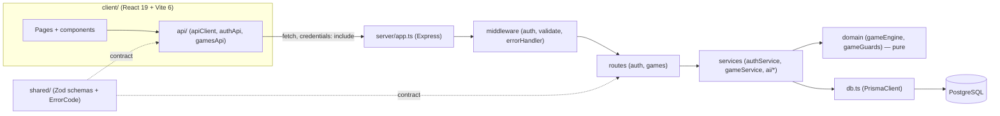
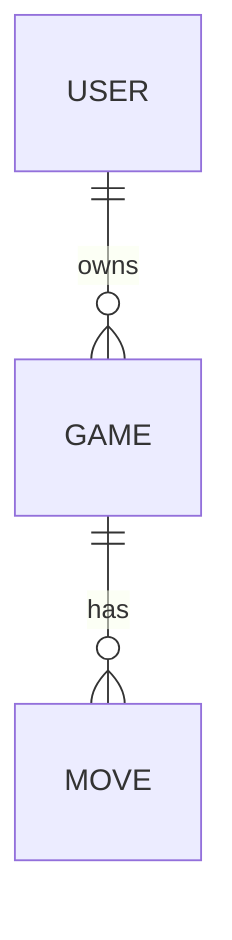
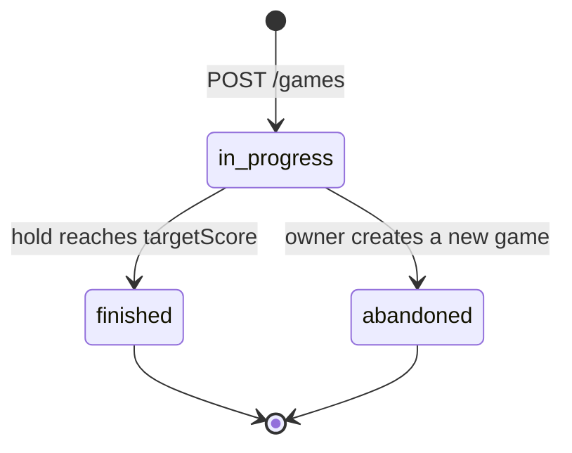

# Roeto Dices Game — Spec

## 0. Meta

- **Source plan:** `docs/plans/PLAN.md`
- **Plan commit:** `f32b777`
- **Repo commit (spec grounded against):** `69bb6c4`
- **Date:** `05-09-2026`
- **Spec version:** v1
- **Status:** Documents the as-built system (M0–M5 shipped)

> **As-built vs. plan.** This spec is grounded in the real repository (Step 2), which was
> deliberately re-scaffolded and hardened after `PLAN.md` was finalized. Two plan decisions were
> reversed in the shipped code and are recorded, not silently followed: **(a)** the monorepo
> (`apps/api`/`apps/web`/`packages/shared`) became a **flat package** (`server`/`client`/`shared`,
> `fullstack-lite`); **(b)** the plan's hardened **CSRF** subsystem was **removed entirely**
> (`SameSite=Lax` is the only remaining mitigation). Both are in §10 with their source. Where the
> plan mandates something absent from the code, it is flagged inline, never invented into the spec.

## 1. Purpose & Scope

A two-player dice game where **all rules live in the backend** and the React frontend only renders
server state and calls the API. Per the assignment's "simulate players on the same page", a single
authenticated user drives both seats on one screen. The server owns identity, the dice, turn order,
scoring, win detection, and every validation. An optional AI opponent plays one seat via an LLM
adapter with a mandatory deterministic heuristic fallback, so the demo and CI never depend on the
network.

**In scope**
- Cookie-based JWT auth: register / login / logout / `GET /auth/me`; bcrypt (cost 12), HS256 with a
  validated secret, IP+username login rate limit, IP register rate limit.
- `tokenVersion` revocation checked on every authenticated request, with a controlled `503` when the
  backing DB read times out or throws (not a misleading `401`).
- Single-owner / two-seat game model; full server-side rule enforcement; roll / hold with optimistic
  concurrency (`expectedVersion` + `FOR UPDATE` row lock).
- Endpoints: register, login, logout, me, list-my-games, create, get, roll, hold, ai-turn.
- Atomic abandon+create; one-live-game partial unique index → `GAME_CONFLICT`; `GAME_ABANDONED`
  distinct from `VERSION_CONFLICT`.
- AI opponent (`ai-turn` only): single-flight claim + bounded provider semaphore released on real
  settlement, decision outside the DB transaction under a 3s deadline, win-safe recoverable move cap
  (50), heuristic fallback.
- DB-level CHECK/trigger invariants (finished-game immutability, mode/seat tie, value ranges,
  winner⇔score consistency), a per-user gameplay rate limit, deterministic `DICE_SEED` for tests.
- `busted` derived from `lastMove` in one mapper. Per-user `wins` incremented on a human win.

**Out of scope**
- Live cross-browser/multi-machine updates; separate opponent accounts / matchmaking.
- Refresh-token rotation (the `tokenVersion` denylist is the revocation middle ground).
- Multi-instance / Redis-backed rate-limit or single-flight store (single-instance, `trust proxy = false`).
- Move-history replay endpoint (`Move` rows are written for audit/AI, not surfaced).

**Non-goals**
- ⚠️ **CSRF defense** — the plan's user-bound token / `Origin` check / `__Host-` cookie was removed
  (§10, demo scope). No `/auth/csrf`, no `X-CSRF-Token`, no `Origin`/`Referer` check.
- A server-side leaderboard endpoint — `User.wins` is persisted but never read back; the on-screen
  leaderboard is per-session React state (`useGameSession`), not a server read.

## 2. System Overview

A React SPA renders server state and issues one API call per action; an Express API owns all logic in
a pure domain engine + services layer, persisting through Prisma to PostgreSQL.



| Component | Responsibility |
|---|---|
| `client/` | Renders `GameStateDto`; every action is an API call. No game logic. |
| `server/app.ts` | `createApp()` wiring: helmet, credentialed CORS, JSON limit, cookie-parser, routers, error handler. Never calls `listen()`. |
| `server/middleware/` | `requireAuth` (cookie JWT + `tokenVersion` check), `validateBody`, central `errorHandler`. |
| `server/routes/` | HTTP only: parse, validate, call service, send. Rate limiters live here. |
| `server/services/` | All business logic + Prisma transactions (`gameService`, `authService`, `ai/*`). |
| `server/domain/` | Pure functions: `roll`, `hold`, seat helpers, guards. Dice injected. |
| `shared/` | Zod schemas (single source of truth), inferred DTOs, `ErrorCode` union + status table. |

## 3. Flows

### Authenticate (register / login)

Login sets an `HttpOnly` cookie; the body carries only non-secret identity. There is no CSRF token.

```mermaid
sequenceDiagram
    actor User
    User->>UI: submit username/password
    UI->>API: POST /auth/login {username, password}
    API->>DB: findUnique(usernameKey)
    API->>API: one bcrypt.compare (dummy hash if user missing)
    API-->>UI: 200 { user } + Set-Cookie token (HttpOnly; SameSite=Lax)
    UI->>API: GET /auth/me (cookie auto-attached)
    API-->>UI: 200 { user }
```

**Preconditions:** valid credentials passing `AuthCredentialsInputSchema` (username 3–30 normalized;
password ≥8 chars and ≤72 UTF-8 bytes). **Postconditions:** an `HttpOnly` JWT cookie (12h, HS256,
`sub`+`tokenVersion`) is set; the client holds no token.

### Play a turn (roll / hold) with optimistic concurrency

Every move locks the row, derives the acting seat from the locked row, and rejects a stale version.

```mermaid
sequenceDiagram
    actor User
    User->>UI: click Roll (expectedVersion=v)
    UI->>API: POST /games/:id/roll {expectedVersion: v}
    API->>DB: BEGIN; SELECT id ... FOR UPDATE
    API->>API: assertActionGuard(game) — rejects AI seat (AI_TURN_REQUIRED)
    API->>API: roll(state, diceRoller) — pure engine
    API->>DB: updateMany WHERE version=v AND status=in_progress
    alt count === 0
        API->>DB: re-read; abandoned? → GAME_ABANDONED else VERSION_CONFLICT
    else count === 1
        API->>DB: move.create(kind: roll); COMMIT
    end
    API-->>UI: 200 GameStateDto (new version)
```

**Preconditions:** caller owns the game; game `in_progress`; current seat is a human seat.
**Postconditions:** exactly one committed move; `version` incremented by 1; on `409 VERSION_CONFLICT`
the client refetches `GET /games/:id` and retries with the fresh version.

### AI turn (single-flight + deadline)

The paid decision is computed outside the transaction; a double-click bills at most one provider call.

```mermaid
sequenceDiagram
    actor User
    User->>UI: state.currentSeat === state.aiSeat
    UI->>API: POST /games/:id/ai-turn {expectedVersion}
    API->>API: assertAiTurnGuard; claimAiTurn(gameId, v)
    alt claim === alreadyInProgress
        API->>DB: getGame (refetch, no provider call)
    else acquired
        API->>API: aiMoveCount >= 50 ? forfeitToHuman()
        API->>API: else resolveAiDecision (semaphore + Promise.race 3s → heuristic on miss)
        API->>DB: aiRollMove / aiHoldMove (increments aiMoveCount) OR forfeit
    end
    API-->>UI: 200 GameStateDto (lastMove.kind: roll|hold|forfeit)
```

**Preconditions:** `mode==='ai'` and `currentSeat===aiSeat`. **Postconditions:** at most one provider
call per `(gameId, expectedVersion)`; claim + semaphore released on the provider promise's real
settlement; a `forfeit` clears `roundScore` and does **not** increment `aiMoveCount`.

## 4. Data Model

Three tables in PostgreSQL via Prisma; DB-level CHECKs/trigger/partial-index are a hand-written raw-SQL
migration on top (`20260904025159_db_invariants`). `busted` is **not** stored on `Game` — it is derived.



### User (`server/prisma/schema.prisma`)

| Field | Type | Constraints | Default | Notes |
|---|---|---|---|---|
| id | String (cuid) | PK | cuid | |
| username | String | — | — | display form |
| usernameKey | String | unique | — | trim + NFKC + lowercase |
| passwordHash | String | — | — | bcrypt cost 12 |
| tokenVersion | Int | — | 0 | bumped to revoke all tokens |
| wins | Int | — | 0 | incremented on a human win; not exposed via API |
| createdAt | DateTime | — | now() | |

### Game

| Field | Type | Constraints (DB) | Default | Notes |
|---|---|---|---|---|
| id | String (cuid) | PK | cuid | |
| ownerUserId | String | FK → User | — | `@@index([ownerUserId, status])` |
| mode | GameMode | `(mode='ai') = (aiSeat IS NOT NULL)` | human | human \| ai |
| aiSeat | Int? | `IN (1,2) OR NULL` | null | |
| aiMoveCount | Int | `>= 0 AND <= 50` | 0 | successful AI moves only |
| targetScore | Int | `BETWEEN 10 AND 1000` | — | set only at create |
| status | GameStatus | trigger blocks UPDATE when old status ≠ in_progress (SQLSTATE `PIGF1`) | in_progress | in_progress \| finished \| abandoned |
| currentSeat | Int | `IN (1,2)` | 1 | |
| p1Score / p2Score | Int | `>= 0` | 0 | |
| roundScore | Int | `>= 0` | 0 | cleared to 0 on hold/bust/forfeit |
| lastDice | Int[] | `cardinality IN (0,2)`, values `<@ {1..6}` | [] | retained through a hold |
| winnerSeat | Int? | `(status='finished') = (winnerSeat IS NOT NULL)`; winner⇔score CHECKs (I7) | null | |
| version | Int | — | 0 | optimistic lock |
| createdAt / updatedAt | DateTime | — | now() / `@updatedAt` | `updatedAt` set client-side |

One-live-game guard: `CREATE UNIQUE INDEX game_one_live_per_owner ON "Game"(ownerUserId) WHERE status='in_progress'`.

### Move

| Field | Type | Constraints | Default | Notes |
|---|---|---|---|---|
| id | String (cuid) | PK | cuid | |
| gameId | String | FK → Game; `@@index([gameId])` | — | |
| actorSeat | Int | — | — | always the locked `currentSeat` |
| kind | MoveKind | — | — | roll \| hold \| forfeit |
| dice | Int[] | — | [] | |
| busted | Boolean | — | false | source for the derived DTO `busted` |
| roundScore | Int | — | — | round score AFTER this move |

## 5. Interfaces & Contracts

The HTTP surface is small and success returns the **bare DTO**; errors return `{ error: { code, message } }`
with `code` from the shared `ErrorCode` union. `/auth/*` is public except `me`/`logout`; all of `/games`
requires the auth cookie.

### HTTP routes

| Method | Path | Body / Query | Auth | Returns |
|---|---|---|---|---|
| GET | `/health` | — | no | `{ status: 'ok' }` |
| POST | `/auth/register` | `{ username, password }` | no (rate-limited 10/hr/ip) | `201 { user }` + auth cookie |
| POST | `/auth/login` | `{ username, password }` | no (rate-limited 5/min/ip+user) | `200 { user }` + auth cookie |
| GET | `/auth/me` | — | cookie | `200 { user: { id, username } }` |
| POST | `/auth/logout` | — | cookie | `204` (clears cookie) |
| GET | `/games?status=in_progress&limit` | query (`limit` ≤50, default 10) | cookie | `GameStateDto[]` (owner's) |
| POST | `/games` | `{ targetScore, mode, aiSeat? }` (`.strict` + refine) | cookie | `201 GameStateDto` |
| GET | `/games/:id` | — | cookie | `GameStateDto` (read guard, any status) |
| POST | `/games/:id/roll` | `{ expectedVersion }` (`.strict`) | cookie (60/min/user) | `GameStateDto` |
| POST | `/games/:id/hold` | `{ expectedVersion }` | cookie (60/min/user) | `GameStateDto` |
| POST | `/games/:id/ai-turn` | `{ expectedVersion }` | cookie (60/min/user) | `GameStateDto` |

### ErrorCode union → HTTP status (`shared/errors.ts`)

`INVALID_INPUT` 400 · `INVALID_CREDENTIALS`/`UNAUTHORIZED` 401 · `FORBIDDEN` 403 · `GAME_NOT_FOUND`/`ROUTE_NOT_FOUND` 404 ·
`VERSION_CONFLICT`/`GAME_ABANDONED`/`GAME_FINISHED`/`GAME_CONFLICT`/`AI_TURN_REQUIRED` 409 · `RATE_LIMITED` 429 ·
`SERVICE_UNAVAILABLE` 503 · `DATABASE_CONSTRAINT` 500.

⚠️ `GAME_FINISHED` is in the union + status table and the DB trigger raises SQLSTATE `PIGF1`, but
`errorHandler.ts` does **not** map `PIGF1` → `GAME_FINISHED` — an unmapped error falls to
`DATABASE_CONSTRAINT` (500). Unreachable in normal flow: every write filters `status:'in_progress'`, so a
finished/abandoned game yields a zero-row update (`VERSION_CONFLICT`/`GAME_ABANDONED`) before the trigger fires.

### Domain engine (`server/domain/gameEngine.ts`)

```ts
type Seat = 1 | 2;
type DiceRoller = () => [number, number];
function roll(state: { currentSeat: Seat; roundScore: number }, diceRoller: DiceRoller): RollOutcome; // 6&6 → busted, round lost, seat passes
function hold(state: { currentSeat: Seat; roundScore: number; p1Score: number; p2Score: number; targetScore: number }): HoldOutcome; // banks seatTotal, nextRoundScore:0, won?
function createDiceRoller(seed?: number): DiceRoller; // seeded mulberry32 when seed set, else Math.random
```

### AI provider contract (`server/services/ai/aiTypes.ts`)

```ts
interface AiDecisionProvider { decide(context: AiDecisionContext, signal: AbortSignal): Promise<AiDecision>; }
// context = { targetScore, currentSeat, seatTotal, roundScore, lastDice, legalActions } — the ONLY data a model sees
const AiDecisionSchema = z.object({ action: z.enum(['roll','hold']) }).strict();
```

**Fails when:** provider missing/errors/times out (3s) or returns an invalid decision → deterministic
heuristic (`hold` if `seatTotal+roundScore >= targetScore`, else `hold` once `roundScore ≥` a per-decision
threshold sampled in 15–25, else `roll`).

## 6. State & Lifecycle

A game moves through three statuses; only `in_progress` is mutable. Within `in_progress`, `currentSeat`
alternates each completed turn (a win keeps the seat).



| From | To | Trigger | Guard |
|---|---|---|---|
| — | in_progress | `POST /games` | create-game refine + one-live-game index |
| in_progress | in_progress | roll / hold / ai-turn | version + status filter; action/ai-turn guard |
| in_progress | finished | hold (or AI hold) where `seatTotal ≥ targetScore` | winner⇔score CHECKs |
| in_progress | abandoned | `POST /games` abandons the prior live game | same transaction as the new create |
| finished / abandoned | (immutable) | any UPDATE attempt | trigger raises `PIGF1`; writes pre-filtered on status |

## 7. Behavioral Rules

| ID | Rule | Why |
|---|---|---|
| BR-1 | A `6 & 6` roll sets `busted`, resets `roundScore` to 0, and passes the seat. | Core game rule. |
| BR-2 | A non-bust roll adds both dice to `roundScore` and keeps the seat. | Core game rule. |
| BR-3 | A hold banks `priorSeatTotal + roundScore` into the seat total and sets `roundScore` to 0. | Prevents double-counting the round. |
| BR-4 | A hold where the banked total `≥ targetScore` finishes the game with that seat as winner. | Win detection. |
| BR-5 | `actorSeat` is always the locked row's `currentSeat`, never the request body. | Closes seat-spoofing. |
| BR-6 | `roll`/`hold` on the AI seat returns `409 AI_TURN_REQUIRED`; `ai-turn` off the AI seat also returns `AI_TURN_REQUIRED`. | The AI seat is reachable only via `ai-turn`. |
| BR-7 | A zero-row update re-reads: `abandoned` → `GAME_ABANDONED`, else `VERSION_CONFLICT`. | Distinguishes a race from an abandon. |
| BR-8 | `wins` increments by exactly one only when the winning seat is a human seat. | AI wins never credit the owner. |
| BR-9 | `POST /games` abandons the prior live game and creates the new one in one transaction. | Owner never left with zero or two live games. |
| BR-10 | Two concurrent creates for one owner → one `201`, one `409 GAME_CONFLICT`. | Partial unique index is the final guard. |
| BR-11 | `aiMoveCount` counts successful AI moves only; the 51st attempt forfeits without incrementing. | Cap can never push the DB CHECK to 51. |
| BR-12 | A forfeit routes through the guarded `updateMany`, clears `roundScore` to 0, and passes to the human seat. | AI round points are never handed to the human. |
| BR-13 | A move that both hits the cap boundary (the 50th) and wins finishes rather than forfeiting. | A winning move always completes. |
| BR-14 | At most one `provider.decide` per `(gameId, expectedVersion)`; the loser refetches. | One committed move costs ≤1 paid call. |
| BR-15 | The claim + semaphore slot release on the provider promise's real settlement, not the 3s wait end. | A hung call can't leak a second call or exceed the bound. |
| BR-16 | The AI adapter receives only the six `AiDecisionContext` fields — never token, username, or raw rows. | Minimal data boundary. |
| BR-17 | The DTO `busted` is derived in the single mapper from `lastMove` (`roll` → its flag, else false). | No stored flag can drift/re-trigger the freeze. |
| BR-18 | A `tokenVersion` read that throws or exceeds 2000ms → `503 SERVICE_UNAVAILABLE`, never `401`. | A DB blip must not read as logged-out. |
| BR-19 | Malformed-JSON body (`entity.parse.failed`) → `400 INVALID_INPUT`. | Broken JSON stays inside the union. |
| BR-20 | Login runs exactly one `bcrypt.compare` (dummy hash when the user is missing) and returns generic `INVALID_CREDENTIALS`. | No user enumeration by message or timing. |

## 8. Non-Functional

| Aspect | Target |
|---|---|
| AI decision latency | Handler waits ≤ `AI_DEADLINE_MS = 3000`ms (`Promise.race`), then heuristic; timeout logged `WARNING`. |
| Auth-path DB read | `tokenVersion` lookup wrapped at 2000ms; provider concurrency capped at 4 (semaphore). |
| Rate limits | login 5/min per ip+username · register 10/hr per ip · gameplay 60/min per JWT `sub`; over-limit → `429`. |
| Security | bcrypt cost 12; JWT HS256 single-algorithm allowlist, secret ≥32 bytes; `HttpOnly; SameSite=Lax; Path=/` cookie (`Secure` in prod); `trust proxy=false`; credentialed CORS pinned to `FRONTEND_URL` (never `*`); helmet; `express.json({ limit: '16kb' })`. No CSRF (§10). |
| Config safety | Prod refuses to boot if `FRONTEND_URL` unset/`localhost` (unless `ALLOW_LOCAL_FRONTEND_URL` for the docker demo); `DICE_SEED` rejected in prod. |
| Runtime targets | Node ESM (`"type":"module"`, `.js` import extensions server-side); React 19 + Vite 6; Prisma 6.19.3 + PostgreSQL 5432; single instance. |
| Tests | Vitest two projects — `web` (jsdom), `api` (real Postgres, serial, `truncateAll()` per test); coverage thresholds 60/60/50. |

## 9. File & Module Manifest

Every path already exists on disk (as-built). Structure is the flat `server`/`client`/`shared` package.

| Path | State | Responsibility | Depends on |
|---|---|---|---|
| `shared/schemas.ts` | existing | `GameStateSchema` (derives `busted`), create/version/list/auth schemas | zod |
| `shared/errors.ts` | existing | `ErrorCode` union + `ERROR_CODE_STATUS` + envelope | zod |
| `shared/index.ts` | existing | barrel re-export | — |
| `server/app.ts` | existing | `createApp()` wiring (no `listen()`) | express, helmet, cors, cookie-parser |
| `server/config/env.ts` | existing | validated env (JWT secret, `FRONTEND_URL`, cookie flags, `DICE_SEED`) | node |
| `server/middleware/auth.ts` | existing | cookie JWT verify + `tokenVersion` check → 401/503 | authCrypto, db |
| `server/middleware/validate.ts` | existing | `validateBody(schema)` | zod |
| `server/middleware/errorHandler.ts` | existing | typed-error / Zod / body-parser mapping → envelope | shared/errors, lib/errors |
| `server/routes/auth.ts` | existing | register/login/me/logout + rate limiters | authService, authCrypto |
| `server/routes/games.ts` | existing | list/create/get/roll/hold/ai-turn + gameplay limiter | gameService, ai/aiTurnService |
| `server/domain/gameEngine.ts` | existing | pure `roll`/`hold`, seat helpers, seeded dice | — |
| `server/domain/gameGuards.ts` | existing | read / action / ai-turn guards | lib/errors |
| `server/lib/authCrypto.ts` | existing | bcrypt, HS256 sign/verify, username normalize | bcryptjs, jsonwebtoken |
| `server/lib/gameMapper.ts` | existing | field-by-field Game→DTO (parses, derives `busted`) | shared/schemas |
| `server/lib/errors.ts` | existing | `AppError` subclasses carrying `errorCode` | — |
| `server/lib/logger.ts` | existing | structured logger (no `console.*`) | — |
| `server/services/gameService.ts` | existing | create/list/get/roll/hold transactions | domain, gameMapper, db |
| `server/services/authService.ts` | existing | register/login/getAuthenticatedUser | authCrypto, db |
| `server/services/ai/aiTurnService.ts` | existing | one-move ai-turn: claim, cap, decide, roll/hold/forfeit | resolveAiDecision, aiTurnConcurrency |
| `server/services/ai/aiTurnConcurrency.ts` | existing | single-flight claim + bounded semaphore | — |
| `server/services/ai/resolveAiDecision.ts` | existing | 3s race, output validation, heuristic fallback | heuristicProvider, aiTypes |
| `server/services/ai/heuristicProvider.ts` | existing | deterministic fallback decision | aiTypes |
| `server/services/ai/buildAiDecisionContext.ts` | existing | narrows a Game to the 6 model-visible fields | aiTypes |
| `server/prisma/schema.prisma` | existing | User/Game/Move models + enums | prisma |
| `server/prisma/migrations/*_db_invariants` | existing | CHECKs, `PIGF1` trigger, one-live-game index | — |
| `client/api/*` | existing | `apiClient`, `authApi`, `gamesApi` (VERSION_CONFLICT refetch) | shared |
| `client/hooks/useGameSession.ts` | existing | drives seats, AI loop, in-session win counts | gamesApi |
| `client/components/*`, `client/pages/*` | existing | board, dice, player cards, leaderboard, login/game pages | hooks, api |

⚠️ **Open question (plan §Open Questions):** the live LLM provider is unimplemented — only the heuristic
ships. `AiDecisionProvider` is the seam; wiring a free-tier provider (Groq / Gemini) is deferred and
requires no code beyond an adapter + key.

## 10. Past Decisions

| Decision | Chosen | Why | Rejected alternative | Source |
|---|---|---|---|---|
| Project structure | Flat `server`/`client`/`shared` (`fullstack-lite`) | Simpler single install/package for a take-home; the monorepo scaffold was never created on disk | pnpm monorepo `apps/api`/`apps/web`/`packages/shared` | CLAUDE.md M0 (supersedes plan §Summary) |
| CSRF defense | Removed entirely; `SameSite=Lax` only | Demo project; hardened CSRF was disproportionate scope | Plan's user-bound HMAC token + `Origin` check + `__Host-` cookie + `/auth/csrf` | CLAUDE.md + git `Remove CSRF logic` (supersedes plan §1, §10) |
| Session-check endpoint | `GET /auth/me` returning `{ user }` | A cookie session needs a "who am I" read; CSRF pre-auth token endpoint was dropped | `GET /auth/csrf` (204, pre-auth token) | code (supersedes plan §5) |
| Auth cookie name | `token` | No CSRF cookie to co-name; `__Host-` prefix tied to the removed CSRF design | `__Host-csrfToken` / `__Host-` prefixed auth cookie | code (supersedes plan §1) |
| Win-count surfacing | `User.wins` persisted, incremented on human win, not exposed via API | On-screen leaderboard is per-session state; no read endpoint was built | A `wins`/leaderboard GET endpoint | code + `useGameSession.ts` |
| `GAME_FINISHED` HTTP mapping | Left unwired; status-filtered writes make the trigger unreachable in flow | `updateMany` status filter returns zero rows first → `VERSION_CONFLICT`/`GAME_ABANDONED` | Mapping `PIGF1` → `GAME_FINISHED` in `errorHandler` | code (plan §11 specified the mapping) |
| Token transport | `HttpOnly; Secure; SameSite=Lax` JWT cookie, no body token | Unreadable by injected script; no `localStorage` | Bearer token in `Authorization` header / `localStorage` | plan: design §1 |
| Revocation | `tokenVersion` denylist checked per request, 503 on DB-unavailable | Real revocation without refresh-token machinery | Full refresh-token rotation | plan: design §1, I8 |
| `busted` field | Derived in one mapper from `lastMove` | No stored flag can drift or re-trigger the freeze | Independent stored `busted` column | plan: I6 |
| AI move cap | Recoverable; counts successful moves; forfeits before the cap | Avoids the CHECK-violation 500 and unearned points | Post-increment cap / hard error at 51 | plan: I1, I4 |
| AI single-flight release | Claim + semaphore released on real settlement, not wait-end | A hung call can't leak a second paid call | Release when the 3s race ends | plan: I2 |
| Heuristic threshold | Per-decision random in 15–25 | Varies AI stopping point instead of a fixed 20 | Fixed `roundScore >= 20` | code (refines plan §9) |

## Appendix A — Glossary

| Term | Means | Identifier in code |
|---|---|---|
| Seat | One of the two players on a game | `Seat = 1 | 2` (`gameEngine.ts`) |
| Round score | Points accumulated this turn, lost on bust/forfeit, banked on hold | `Game.roundScore` |
| Seat total | A seat's banked global score | `Game.p1Score` / `p2Score`; `HoldOutcome.seatTotal` |
| Bust | A `6 & 6` roll losing the round and passing the seat | `RollOutcome.busted`; derived DTO `busted` |
| Forfeit | AI cap hand-back to the human, round cleared | `MoveKind.forfeit`; `forfeitAiTurn` |
| Optimistic version | Row version echoed as `expectedVersion` | `Game.version`; `ExpectedVersionSchema` |
| Single-flight claim | Per `(gameId, expectedVersion)` lock guarding the paid AI call | `claimAiTurn` (`aiTurnConcurrency.ts`) |
| Token version | Per-user revocation counter in the JWT and DB | `User.tokenVersion`; `requireAuth` |
